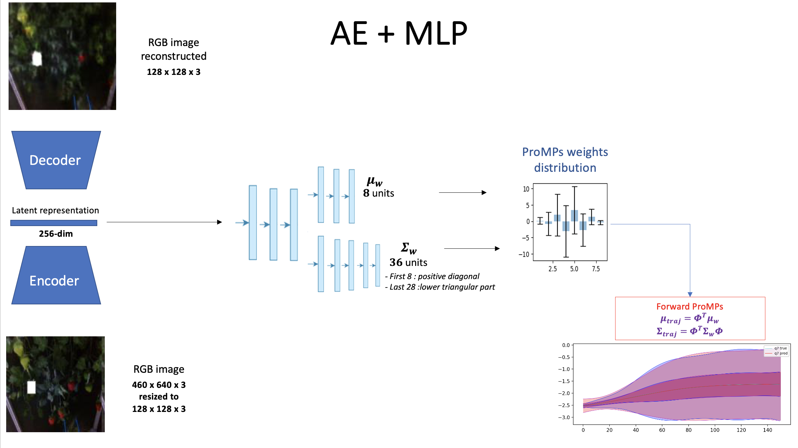
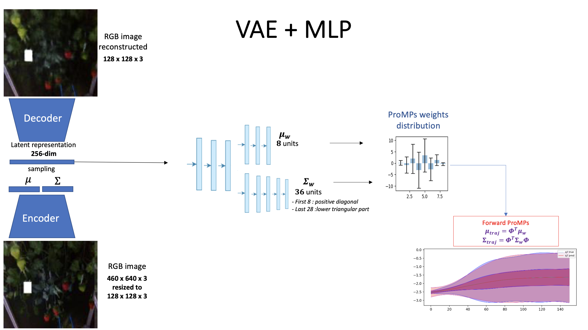
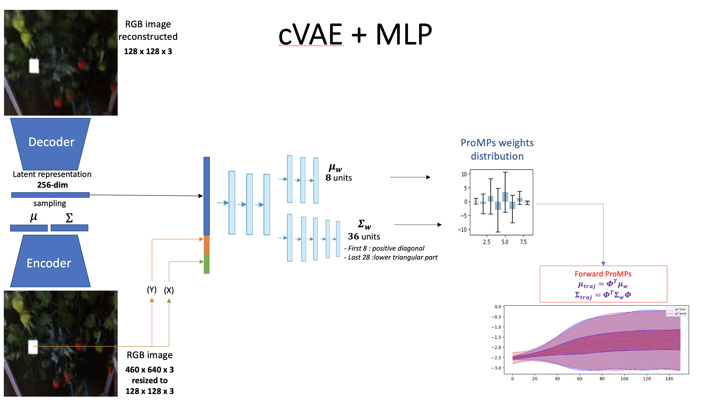

# Deep ProMPs learning for strawberry picking


<!-- TABLE OF CONTENTS -->
## Table of Contents

* [About the Project](#about-the-project)
  * [Built With](#built-with)
* [Getting Started](#getting-started)
   * [Set Up](#Set-Up)
   * [Dataset](#Dataset)
   * [Code](#Code)
* [Usage](#usage)
    * [Joint Space](#Joint-Space)
    * [Task Space](#Task-Space)
* [Results](#results)
    * [Joint Space](#Joint-Space)
    * [Task Space](#Task-Space)
* [References](#references)
* [Contact](#contact)


## About The Project

The project is about Probabilistic Movement Primitives prediction through Deep models. Everything is applied to the Agri-robotics framework, in particular to the problem of strawberry picking.

The particular task considered is the Reach to Pick task so the simple action of approaching a target ripe strawberry with a robotic arm. This task should be performed using as input simply the RGB image of the strawberry cluster from the home position.

The movement is predicted using movement primitives as encoding method so that only a bunch of weights needs to be predicted by the deep neural network taking as input the image from the home position.

In particular the predicted policy is not deterministic but stochastic since the model is trained on a distribution of trajectories provided as demonstrations.

Three baselines have been followed to predict the mean and covariance of the ProMps weights describing the trajectory of to reach a target berry.

The first one is: Auto Encoder + Multi Layer Perceptron model.



The second one is: Variational Auto Encoder + Multi Layer Perceptron model.



The last one is: Variational Auto Encoder + Multi Layer Perceptron model conditioned with the x,y pixel coordinates of the enter of the bounding box of the target barry.



All the baselines have been tested both on joint and in task space.

## Build With

All the models are trained using [Tensorflow 2.7](https://pypi.org/project/tensorflow/) .

## Getting Started

### Dataset

The complete dataset is contained in the folder ```dataset/```. It is made by RGB images and the annotations of the ProMs weights in joint and task space of the collected demonstrations in  ```dataset/annotations``` and ```dataset/annotations_task```. The RGB images are separated in 3 folders: 

- ```dataset/rgb_segmented_white``` contains 252 RGB images with the annotated bounding box extracted with Detectron2 for which the trajectory has been collected.
- ```dataset/additional_segmented``` contains 505 addtional RGB images with the annotated bounding box extracted with Detectron2 for which the trajectory has not been collected.
- ```dataset/rgb_tot_white``` merges the 2 previous folders.

The complete dataset can be downloaded at this [link](https://drive.google.com/drive/folders/1k7QSSXEPNbt2EQn0ZCS2IrFKZuag864N?usp=sharing)

In the ```preprocessing/``` folder there are all the codes for the preprocessing of the collected images (segmentation) and trajectories.

### Code

In the ```code/``` folder there are the scripts to train the Autoencoder and Variational Autoencoder models
- ```code/Autoencoder```
- ```code/VAE```

and the scripts to train the 7 models (one for each joint) using repectively the AE or VAE or cVAE

- ```code/Models_AE```
- ```code/Models_VAE```
- ```code/Models_cVAE```


## Usage

To train or evaluate the AE or VAE model run:

```
python code/Autoencoder/train_test.py
```
or

```
python code/VAE/train_test.py
```
### Joint space

To train or evaluate the models for ProMPs prediciton of the first joint based on AE or VAE or cVAE run:

```
python code/Models_AE/J1/train_test.py
```
or

```
python code/Models_VAE/J1/train_test.py
```

or 
```
python code/Models_cVAE/J1/train_test.py
```
The same applies for the other joints.

### Task space

To train or evaluate the models for ProMPs prediciton of the coordinate X based on AE or VAE or cVAE run:

```
python code/Models_AE_task/X/train_test.py
```
or

```
python code/Models_VAE_task/X/train_test.py
```

or 
```
python code/Models_cVAE_task/X/train_test.py
```
The same applies for the other coordinates and quaternions components.

### Results

#### Joint space

Comparing the three architectures the performances increase going from AE to VAE to cVAE models!

RMSE(mean_traj)+ RMSE(cov_traj)

| Joints      | Autoencoder     | Variational Autoencoder     | Error reduction     | Conditional Variational Autoencoder     | Error reduction     |
| ----------- | --------------- | --------------------------- |-------------------- | --------------------------------------- | ------------------- | 
| J1          | 0.000544        | 0.000139                    | - 74%               | 0.00010                                 | - 28%               | 
| J2          | 0.004899        | 0.001445                    | - 70%               | 0.00090                                 | - 38%               | 
| J3          | 0.009301        | 0.000963                    | - 89%               | 0.00059                                 | - 38%               | 
| J4          | 0.003711        | 0.001939                    | - 47%               | 0.00059                                 | - 71%               | 
| J5          | 0.002424        | 0.002357                    | - 2.7%              | 0.0020                                  | - 13%               | 
| J6          | 0.002901        | 0.001545                    | - 48%               | 0.001545                                | - 0%                | 
| J7          | 0.002140        | 0.000543                    | - 74%               | 0.000543                                | - 0%             | 

#### Task space

Comparing the three architectures the performances increase going from AE to VAE to cVAE models!

RMSE(mean_traj)+ RMSE(cov_traj)

| Coordinates | Autoencoder     | Variational Autoencoder     | Error reduction     | Conditional Variational Autoencoder     | Error reduction     |
| ----------- | --------------- | --------------------------- |-------------------- | --------------------------------------- | ------------------- | 
| X           | 0.000140        | 0.000140                    | - 0%                | 0.000140                                | - 0%                | 
| Y           | 0.001531        | 0.000705                    | - 53%               | 0.000088                                | - 88%               | 
| Z           | 0.000092        | 0.000012                    | - 88%               |                               | - %                | 
| Q1          | 0.000153        | 0.000057                    | - 68%               |                               | - %                 | 
| Q2          | 0.002424        | 0.000410                    | - 83%               | 0.0001568                               | - 75%               | 
| Q3          | 0.000115        | 0.000037                    | - 80%               | 0.000021                                | - 43%               | 
| Q4          | 0.000078        | 0.000036                    | - 68%               |                                | - %                | 


## References

#### ProMPs:

http://eprints.lincoln.ac.uk/id/eprint/25785/1/5177-probabilistic-movement-primitives.pdf

## Contact

For any issues please contact Alessandra Tafuro at taffi98.at@gmail.com
